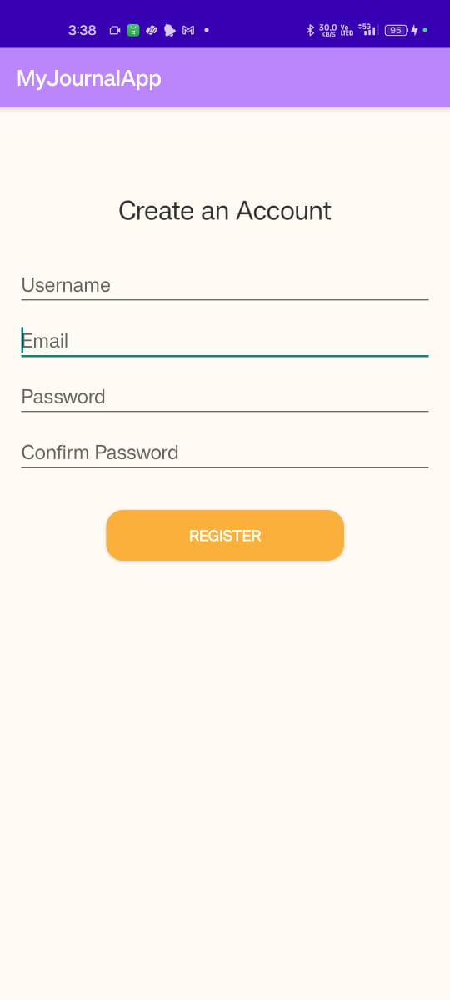
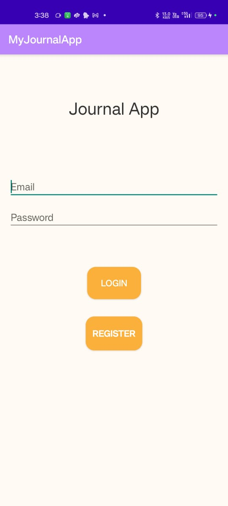
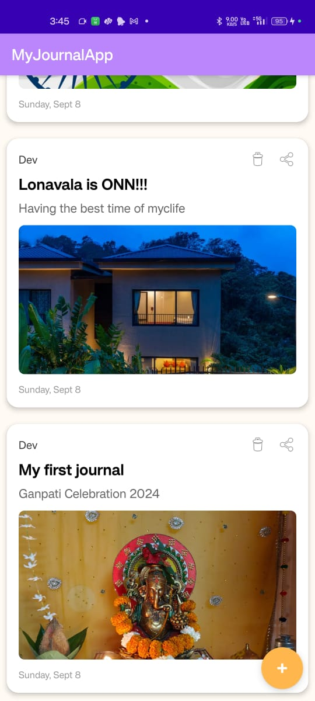
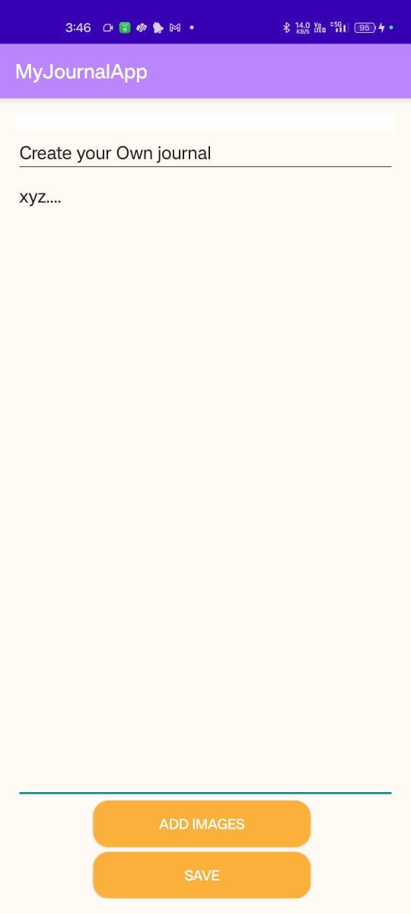

# 📝 Android Journal App

## Overview
This **Android Journal App** is a personal journaling application that allows users to create, view, edit, and delete journal entries. It incorporates user authentication, image uploads, and real-time data synchronization using Firebase.

## 📸 Screenshots

### App Screens

  
  
  

  
  

## Features
- 🔒 **User Registration and Authentication**
- 🖋️ **Create new journal entries with text and images**
- 📋 **View list of journal entries**
- 🔍 **View detailed journal entries**
- ✏️ **Edit existing entries**
- 🗑️ **Delete entries**
- 📤 **Share entries**
- 🔄 **Real-time updates**

## Technical Stack
- 💻 **Language**: Java
- 📱 **Platform**: Android
- ☁️ **Backend**: Firebase (Authentication, Firestore, Storage)
- 🖼️ **Image Loading**: Glide

## Project Structure
The project consists of the following main components:

- **📂 MainActivity.java**: Handles user login
- **🆕 RegisterActivity.java**: Manages user registration
- **📜 JournalListActivity.java**: Displays the list of journal entries
- **📝 CreateEntryActivity.java**: Allows users to create new entries
- **🔎 ViewEntryActivity.java**: Shows detailed view of an entry
- **✏️ EditEntryActivity.java**: Enables users to edit existing entries
- **🗃️ JournalAdapter.java**: RecyclerView adapter for displaying journal entries
- **🗂️ JournalEntry.java**: Model class for journal entries

## Setup and Installation
1. ⬇️ Clone the repository
2. 🚀 Open the project in Android Studio
3. 🔗 Connect the app to your Firebase project:
   - Create a new project in the Firebase console
   - Add an Android app to the Firebase project
   - Download the `google-services.json` file and place it in the app module of your project
4. ✅ Enable Firebase Authentication and Firestore in your Firebase project
5. 🛠️ Build and run the application on an emulator or physical device

## Usage
1. 📱 Launch the app and register a new account or log in
2. ➕ Use the floating action button to create a new journal entry
3. 🖊️ Add a title, content, and optionally upload images to your entry
4. 📑 View your entries in the main list
5. 🔧 Tap on an entry to view details, edit, or delete it

## Contributing
Contributions to improve the app are welcome! 🎉 Please follow these steps:

1. 🍴 Fork the repository
2. 🌿 Create a new branch for your feature
3. 💾 Commit your changes
4. ⬆️ Push to your branch
5. 📩 Create a pull request

## License
This project is licensed under the MIT License.

